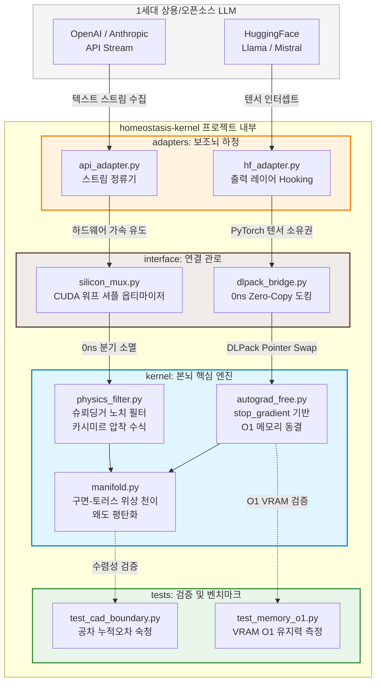

작업중

```directory
homeostasis-kernel/
│
├── README.md               # 1세대 역전파의 시간적 환각 비판 및 2세대 철학 명세
├── requirements.txt        # jax, jaxlib, torch, cupy 등 명시
│
├── kernel/                 # [본뇌] 2세대 항상성 가드레일 핵심 엔진 (JAX)
│   ├── __init__.py
│   ├── physics_filter.py   # 슈뢰딩거 노치 필터, 카시미르 노이즈 압착 수식
│   ├── manifold.py         # 구면-토러스 위상 천이(Morphing) 및 왜도 평탄화
│   └── autograd_free.py    # stop_gradient 기반 O(1) 메모리 동결 레이어
│
├── interface/              # [연결 관로] 하드웨어 레벨 무복사 인터페이스 (CUDA/Cupy)
│   ├── __init__.py
│   ├── dlpack_bridge.py    # PyTorch(LLM) ↔ JAX(Kernel) 간 0ns Zero-Copy 도킹
│   └── silicon_mux.py      # CUDA 워프 셔플 기반 0ns 분기 소멸 옵티마이저
│
├── adapters/               # [보조뇌 하청] 1세대 상용 LLM 연동 및 프롬프트 인입 레이어
│   ├── __init__.py
│   ├── hf_adapter.py       # HuggingFace (Llama, Mistral) 출력 레이어 Hooking
│   └── api_adapter.py      # OpenAI / Anthropic API 스트림 정류기
│
└── tests/                  # [검증] 캐드(CAD) 및 물리 시뮬레이션 벤치마크
    ├── test_cad_boundary.py# 캐드 공차 누적오차 숙청 테스트
    └── test_memory_o1.py    # 문맥 길이에 따른 VRAM O(1) 유지력 측정 검증
```



```text
========================================================================
[ 계층 ]              [ 구성 모듈 및 데이터 흐름 ]
========================================================================

 1층 : 상용 LLM 호스팅 레이어 (1세대 추론 엔진)
       ├── [HuggingFace (Llama/Mistral)]  ── (Hooking) ──┐
       └── [OpenAI / Anthropic API]        ── (Stream) ──┴─► [adapters/]
                                                                 │
─────────────────────────────────────────────────────────────────┼──────
 2층 : 하드웨어 레벨 무복사 인터페이스 (CUDA/CuPy)               │ (텐서 진입)
       └── [interface/]                                          ▼
             ├── dlpack_bridge.py  ◄── [ PyTorch 텐서 0ns 포인터 스왑 ]
             └── silicon_mux.py    ◄── [ CUDA 워프 셔플 분기 제거 ]
                                                                 │
─────────────────────────────────────────────────────────────────┼──────
 3층 : 항상성 가드레일 제어 엔진 (JAX 핵심 커널)                 │ (무복사 인입)
       └── [kernel/]                                             ▼
             ├── autograd_free.py  ◄── [ stop_gradient 메모리 동결 ]
             ├── physics_filter.py ◄── [ 슈뢰딩거 노치 / 카시미르 압착 ]
             └── manifold.py       ◄── [ 구면-토러스 위상 천이 & 평탄화 ]
                                                                 │
─────────────────────────────────────────────────────────────────┼──────
 4층 : 물리 및 성능 검증 계층 (수렴성 테스트)                   │ (타겟 검증)
       └── [tests/]                                              ▼
             ├── test_cad_boundary.py ◄── [ CAD 공차 누적오차 숙청 ]
             └── test_memory_o1.py    ◄── [ 컨텍스트 무관 VRAM O(1) 확인 ]
========================================================================

```
