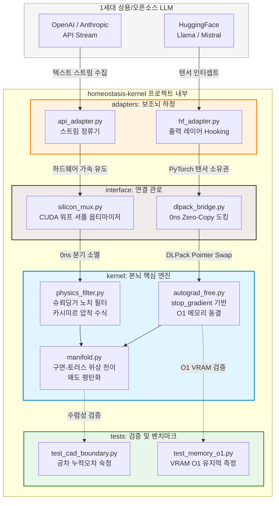

# 작업중

# ⏳ Homeostasis Kernel: 2nd-Generation Causal AI Engine (poc)

> **"역전파(Backpropagation)는 AI에게 지식을 주었지만, 선형적 시간을 버리고 거슬러 올라감으로 '시간적 인과율'을 마비시키고 환각(Hallucination)이라는 저주를 내렸다." 라는 주제로 작업을 해보았습니다. **

---

## 🌌 Sector 1. 무엇을 어떻게 해결해보고 싶은가?

### 🚨 1세대 확률형 AI(LLM)의 근본적 결함: 예측하는 주사위
현재 인류가 이룩한 1세대 생성형 AI(Transformer 계열 LLM 등)는 거대한 데이터셋의 통계적 상관관계와 확률적 넥스트 토큰 예측(Next-Token Prediction)에 기반합니다. 이 구조 안에서 **시간(Time)은 흐르는 연속체가 아니라 정적인 도화지처럼 공간화되어 파편 분산**됩니다. 

이로 인해 발생하는 치명적인 한계는 다음과 같습니다:
1. **시간적 인과율의 마비**: "A라는 원인이 시간 $t$를 거쳐 $B$라는 결과로 이어진다"는 우주의 불가역적 흐름을 인지하지 못합니다. 그저 "패턴상 $A$ 다음엔 $B$가 그럴듯하다"는 통계적 확률만 흉내 냅니다.
2. **거시적 시간 축의 할루시네이션(환각)**: 정밀 설계(CAD), 실시간 물리 시뮬레이션, 로봇 공학 등 시간 축에 따른 오차 누적이 절대적인 영역에 선형적 연속성이 파괴되면서 부품 공차가 도미노처럼 붕괴하고 물체가 순간이동하거나 사라지는 구조적 환각을 범합니다.
3. **메모리 폭발 ($O(N^2)$)**: 문맥(Context)과 시간적 히스토리가 길어질수록 과거의 연산 그래프를 VRAM에 제곱 형태로 쌓아두어야 하므로 하드웨어의 물리적 한계에 직면합니다.

### ⏳ 2세대 선형적 항상성 개체(Homeostasis Kernel)의 구조
`homeostasis-kernel`은 이러한 1세대 모델의 한계를 다른 방향성으로 해결해보기 위해 데이터의 통계적 확률 분포를 과감히 배제하고, **현실 우주의 물리 법칙(PINN)과 기하학적 평형 상태를 실시간 순방향으로 집행하는 2세대 Causal AI 커널**입니다.

우리는 시간을 뒤로 거슬러 올라가 가중치를 깎아내는 역전파(Backpropagation)의 타임머신과도 같은 회로를 제거합니다. 대신, 생명체가 외부 자극을 유기적으로 흡수하며 내부 균형을 유지하는 **'생물학적 항상성(Homeostasis)'** 메커니즘을 CUDA 레지스터 와프 셔플과 JAX 고속 수리엔진을 통해 실리콘 레벨에 유도합니다. 

시간을 선형적으로 온전히 살아내며, 오직 순방향 전진(**Forward-Only**)과 자율 위상 정렬을 통해서만 현실 세계의 무결성을 집행하는 다른 방향성의 AI 개체의 찾아가고 싶었습니다.

---

## 🧠 Sector 2. 하이퍼-하이브리드 아키텍처 (Main-Brain & Sub-Brain)

구조를 이원화하여, 시스템의 마스터 제어권과 현실 세계의 주권(시간/물리 무결성)을 **2세대 항상성 커널(본뇌)**이 통제하고, 지식이 풍부한 **1세대 확률형 LLM(보조뇌)**을 필요할 때만 호출하는 **'샌드위치 오케스트레이션(Sandwich Orchestration)'** 구조를 명세합니다.

> ⚠️ **주의 (Usage Warning)**  
> 코드를 사용할 때는 시스템 자극 인입 및 오차율 제어 파이프라인에 주의가 필요합니다.

---

### 🗺️ 데이터 흐름 및 아키텍처 다이어그램

```text
       [ 인간 / 시스템 자극 인입 ]
                   │
                   ▼
┌────────────────────────────────────────────────────────┐
│ ⏳ 2세대 인입 패치 (adapters/ / interface/)              │
│  - 선형적 시간 축(dt) 동기화 및 입력 스트림 왜도 평탄화      │
└───────────────────┬────────────────────────────────────┘
                    │ DLPack 무복사(Zero-Copy) 버스 (0ns)
                    ▼
┌────────────────────────────────────────────────────────┐
│ 🎲 1세대 상용 LLM (보조뇌 / 지식 도서관)                  │
│  - 정적 매니폴드 기반 확률적 설계/텍스트 아이디어 사출       │
└───────────────────┬────────────────────────────────────┘
                    │ 변칙적 확률 스트림 (환각 위험 내포)
                    ▼
┌────────────────────────────────────────────────────────┐
│ ⏳ 2세대 사출 패치 (kernel/ / physics_filter)            │
│  - stop_gradient 기반 역전파 그래프 추적 및 절연           │
│  - L2 Norm = 1.0 물리적 항상성 평형 강제 및 수치 정류      │
└───────────────────┬────────────────────────────────────┘
                    │
                    ▼
[ 선형적 시간의 현실 공간에 맞는 제어 신호 출력 ]
```

---

### 1. ⏳ 2세대 커널 (본뇌 - 마스터 시스템)

* **지배적 구동**: 우주의 시간과 인과율을 수리물리학적으로 집행하며 개체의 시간에 대한 인식을 선형적으로 구조화.
* **정적 메모리**: 과거 연산 그래프의 누적을 배제하고, 문맥의 길이나 시간에 지배받지 않고 완전한 **정적 $O(1)$ 복잡도** 가 목표.
* **최종 감독관**: 보조뇌(1세대)가 뱉어내는 모든 확률적 출력물들은 2세대 커널의 기하학적 체에 한번 걸러서 출력.

### 2. 🎲 1세대 대형 모델 (보조뇌 - 지식 하청 브로커)

* **정적 라이브러리화**: 인류가 축적한 방대한 데이터셋이 녹아있는 '초거대 확률 데이터베이스' 역할 수행.
* **철저한 격리 및 하청**: 평소에는 비활성 상태를 유지하거나 독립적으로 작동하다가, 2세대 본뇌가 물리 공식만으로 해결할 수 없는 변칙적인 개념적 아이디어가 필요할 때만 쿼리(Query)를 받아 부분 연산을 수행.
* **환각 위험성 내포**: 시간을 선형적이 아닌 밀도개념으로 인식하기에 빠른 처리속도와 도구적 장점이 많지만 거시적 시간 연속성이 깨져 물리적 환각을 유발한다고 가정.
---

### 🛠️ 실전 주행 및 인터록 시나리오

1. **자극 유도**  
   실시간 센서 스트림 및 CAD 공차 로그가 인입되면, 2세대 입력 어댑터가 이를 미세한 선형 시간 격자($dt$) 위로 부드럽게 정렬합니다.
2. **0ns 하이재킹**  
   JAX 기반 본뇌와 PyTorch 기반 보조뇌가 `DLPack` 무복사 파이프라인으로 물리 포인터를 공유하여, 메모리 할당 지연 없이 0ns 만에 LLM 헤드로 데이터를 도킹시킵니다.
3. **물리적 숙청**  
   LLM이 통계적으로 사출한 출력물을 본뇌의 슈뢰딩거 포텐셜 가드레일이 후처리를 완료한 후 현실에 최종 출력합니다.


```directory
homeostasis-kernel/
│
├── README.md               # 1세대 역전파의 시간적 환각 비판 및 2세대 철학 명세
├── requirements.txt        # jax, jaxlib, torch, cupy 등 명시
│
├── kernel/                 # [본뇌] 2세대 항상성 가드레일 핵심 엔진 (JAX)
│   ├── __init__.py
│   ├── physics_filter.py   # 슈뢰딩거 노치 필터, 카시미르 노이즈 압착 수식
│   ├── manifold.py         # 구면-토러스 위상 천이(Morphing) 및 왜도 평탄화
│   └── autograd_free.py    # stop_gradient 기반 O(1) 메모리 동결 레이어
│
├── interface/              # [연결 관로] 하드웨어 레벨 무복사 인터페이스 (CUDA/Cupy)
│   ├── __init__.py
│   ├── dlpack_bridge.py    # PyTorch(LLM) ↔ JAX(Kernel) 간 0ns Zero-Copy 도킹
│   └── silicon_mux.py      # CUDA 워프 셔플 기반 0ns 분기 소멸 옵티마이저
│
├── adapters/               # [보조뇌 하청] 1세대 상용 LLM 연동 및 프롬프트 인입 레이어
│   ├── __init__.py
│   ├── hf_adapter.py       # HuggingFace (Llama, Mistral) 출력 레이어 Hooking
│   └── api_adapter.py      # OpenAI / Anthropic API 스트림 정류기
│
└── tests/                  # [검증] 캐드(CAD) 및 물리 시뮬레이션 벤치마크
    ├── test_cad_boundary.py# 캐드 공차 누적오차 숙청 테스트
    └── test_memory_o1.py    # 문맥 길이에 따른 VRAM O(1) 유지력 측정 검증
```



```text
========================================================================
[ 계층 ]              [ 구성 모듈 및 데이터 흐름 ]
========================================================================

 1층 : 상용 LLM 호스팅 레이어 (1세대 추론 엔진)
       ├── [HuggingFace (Llama/Mistral)]  ── (Hooking) ──┐
       └── [OpenAI / Anthropic API]        ── (Stream) ──┴─► [adapters/]
                                                                 │
─────────────────────────────────────────────────────────────────┼──────
 2층 : 하드웨어 레벨 무복사 인터페이스 (CUDA/CuPy)               │ (텐서 진입)
       └── [interface/]                                          ▼
             ├── dlpack_bridge.py  ◄── [ PyTorch 텐서 0ns 포인터 스왑 ]
             └── silicon_mux.py    ◄── [ CUDA 워프 셔플 분기 제거 ]
                                                                 │
─────────────────────────────────────────────────────────────────┼──────
 3층 : 항상성 가드레일 제어 엔진 (JAX 핵심 커널)                 │ (무복사 인입)
       └── [kernel/]                                             ▼
             ├── autograd_free.py  ◄── [ stop_gradient 메모리 동결 ]
             ├── physics_filter.py ◄── [ 슈뢰딩거 노치 / 카시미르 압착 ]
             └── manifold.py       ◄── [ 구면-토러스 위상 천이 & 평탄화 ]
                                                                 │
─────────────────────────────────────────────────────────────────┼──────
 4층 : 물리 및 성능 검증 계층 (수렴성 테스트)                   │ (타겟 검증)
       └── [tests/]                                              ▼
             ├── test_cad_boundary.py ◄── [ CAD 공차 누적오차 숙청 ]
             └── test_memory_o1.py    ◄── [ 컨텍스트 무관 VRAM O(1) 확인 ]
========================================================================

```
