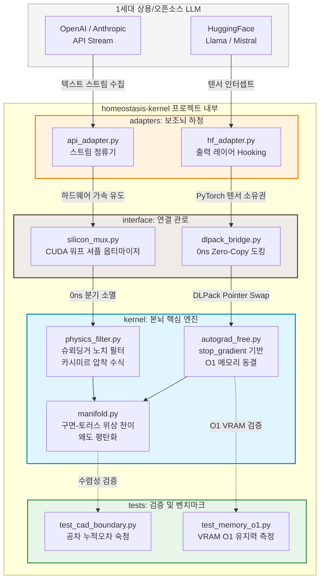

# 작업중

# ⏳ Homeostasis Kernel: 2nd-Generation Causal AI Engine (poc)

> **"역전파(Backpropagation)는 AI에게 지식을 주었지만, 선형적 시간을 버리고 거슬러 올라감으로 '시간적 인과율'을 마비시키고 환각(Hallucination)이라는 저주를 내렸다." 라는 주제로 작업을 해보았습니다. **

---

## 🌌 Sector 1. 무엇을 어떻게 해결해보고 싶은가?

### 🚨 1세대 확률형 AI(LLM)의 근본적 결함: 예측하는 주사위
현재 인류가 이룩한 1세대 생성형 AI(Transformer 계열 LLM 등)는 거대한 데이터셋의 통계적 상관관계와 확률적 넥스트 토큰 예측(Next-Token Prediction)에 기반합니다. 이 구조 안에서 **시간(Time)은 흐르는 연속체가 아니라 정적인 도화지처럼 공간화되어 파편 분산**됩니다. 

이로 인해 발생하는 치명적인 한계는 다음과 같습니다:
1. **시간적 인과율의 마비**: "A라는 원인이 시간 $t$를 거쳐 $B$라는 결과로 이어진다"는 우주의 불가역적 흐름을 인지하지 못합니다. 그저 "패턴상 $A$ 다음엔 $B$가 그럴듯하다"는 통계적 확률만 흉내 냅니다.
2. **거시적 시간 축의 할루시네이션(환각)**: 정밀 설계(CAD), 실시간 물리 시뮬레이션, 로봇 공학 등 시간 축에 따른 오차 누적이 절대적인 영역에 선형적 연속성이 파괴되면서 부품 공차가 도미노처럼 붕괴하고 물체가 순간이동하거나 사라지는 구조적 환각을 범합니다.
3. **메모리 폭발 ($O(N^2)$)**: 문맥(Context)과 시간적 히스토리가 길어질수록 과거의 연산 그래프를 VRAM에 제곱 형태로 쌓아두어야 하므로 하드웨어의 물리적 한계에 직면합니다.

### ⏳ 2세대 선형적 항상성 개체(Homeostasis Kernel)의 구조
`homeostasis-kernel`은 이러한 1세대 모델의 한계를 다른 방향성으로 해결해보기 위해 데이터의 통계적 확률 분포를 과감히 배제하고, **현실 우주의 물리 법칙(PINN)과 기하학적 평형 상태를 실시간 순방향으로 집행하는 2세대 Causal AI 커널**입니다.

우리는 시간을 뒤로 거슬러 올라가 가중치를 깎아내는 역전파(Backpropagation)의 타임머신과도 같은 회로를 제거합니다. 대신, 생명체가 외부 자극을 유기적으로 흡수하며 내부 균형을 유지하는 **'생물학적 항상성(Homeostasis)'** 메커니즘을 CUDA 레지스터 와프 셔플과 JAX 고속 수리엔진을 통해 실리콘 레벨에 유도합니다. 

시간을 선형적으로 온전히 살아내며, 오직 순방향 전진(**Forward-Only**)과 자율 위상 정렬을 통해서만 현실 세계의 무결성을 집행하는 다른 방향성의 AI 개체의 찾아가고 싶었습니다.

---

## 🧠 Sector 2. 하이퍼-하이브리드 아키텍처 (Main-Brain & Sub-Brain)

구조를 이원화하여, 시스템의 마스터 제어권과 현실 세계의 주권(시간/물리 무결성)을 **2세대 항상성 커널(본뇌)**이 통제하고, 지식이 풍부한 **1세대 확률형 LLM(보조뇌)**을 필요할 때만 호출하는 **'샌드위치 오케스트레이션(Sandwich Orchestration)'** 구조를 명세합니다.

> ⚠️ **주의 (Usage Warning)**  
> 코드를 사용할 때는 시스템 자극 인입 및 오차율 제어 파이프라인에 주의가 필요합니다.

---

### 🗺️ 데이터 흐름 및 아키텍처 다이어그램

```text
       [ 인간 / 시스템 자극 인입 ]
                   │
                   ▼
┌────────────────────────────────────────────────────────┐
│ ⏳ 2세대 인입 패치 (adapters/ / interface/)              │
│  - 선형적 시간 축(dt) 동기화 및 입력 스트림 왜도 평탄화     │
└───────────────────┬────────────────────────────────────┘
                    │ DLPack 무복사(Zero-Copy) 버스 (0ns)
                    ▼
┌────────────────────────────────────────────────────────┐
│ 🎲 1세대 상용 LLM (보조뇌 / 지식 도서관)                  │
│  - 정적 매니폴드 기반 확률적 설계/텍스트 아이디어 사출       │
└───────────────────┬────────────────────────────────────┘
                    │ 변칙적 확률 스트림 (환각 위험 내포)
                    ▼
┌────────────────────────────────────────────────────────┐
│ ⏳ 2세대 사출 패치 (kernel/ / physics_filter)            │
│  - stop_gradient 기반 역전파 그래프 추적 및 절연           │
│  - L2 Norm = 1.0 물리적 항상성 평형 강제 및 수치 정류      │
└───────────────────┬────────────────────────────────────┘
                    │
                    ▼
[ 선형적 시간의 현실 공간에 맞는 제어 신호 출력 ]
```

---

### 1. ⏳ 2세대 커널 (본뇌 - 마스터 시스템)

* **지배적 구동**: 우주의 시간과 인과율을 수리물리학적으로 집행하며 개체의 시간에 대한 인식을 선형적으로 구조화.
* **정적 메모리**: 과거 연산 그래프의 누적을 배제하고, 문맥의 길이나 시간에 지배받지 않고 완전한 **정적 $O(1)$ 복잡도** 가 목표.
* **최종 감독관**: 보조뇌(1세대)가 뱉어내는 모든 확률적 출력물들은 2세대 커널의 기하학적 체에 한번 걸러서 출력.

### 2. 🎲 1세대 대형 모델 (보조뇌 - 지식 하청 브로커)

* **정적 라이브러리화**: 인류가 축적한 방대한 데이터셋이 녹아있는 '초거대 확률 데이터베이스' 역할 수행.
* **철저한 격리 및 하청**: 평소에는 비활성 상태를 유지하거나 독립적으로 작동하다가, 2세대 본뇌가 물리 공식만으로 해결할 수 없는 변칙적인 개념적 아이디어가 필요할 때만 쿼리(Query)를 받아 부분 연산을 수행.
* **환각 위험성 내포**: 시간을 선형적이 아닌 밀도개념으로 인식하기에 빠른 처리속도와 도구적 장점이 많지만 거시적 시간 연속성이 깨져 물리적 환각을 유발한다고 가정.
---

### 🛠️ 실전 주행 및 인터록 시나리오

1. **자극 유도**  
   실시간 센서 스트림 및 CAD 공차 로그가 인입되면, 2세대 입력 어댑터가 이를 미세한 선형 시간 격자($dt$) 위로 부드럽게 정렬합니다.
2. **0ns 하이재킹**  
   JAX 기반 본뇌와 PyTorch 기반 보조뇌가 `DLPack` 무복사 파이프라인으로 물리 포인터를 공유하여, 메모리 할당 지연 없이 0ns 만에 LLM 헤드로 데이터를 도킹시킵니다.
3. **출력전 후처리**  
   LLM이 통계적으로 사출한 출력물을 본뇌의 슈뢰딩거 포텐셜 가드레일이 후처리를 완료한 후 현실에 최종 출력합니다.


---

## 📐 Sector 3. 수리물리학적 가드레일 수식 명세 (Mathematical Core)

본뇌 커널(`kernel/`) 내부에서 순방향 전진(**Forward-Only**) 주행 시, 선형적 시간을 부여하고 수치 발산을 막는 4가지 수리물리학적 방정식 입니다.

---

### 1. 🔒 자동 미분 절연 및 정적 복잡도 방정식 (Gradient Isolation)
1세대 AI의 문맥 길이에 따른 VRAM 폭발($O(N^2)$)을 막기 위해, 시간 축 방향의 사후적 오차 역전파 그래프 사슬을 강제로 절연합니다. 

$$\mathbf{X}_{\text{isolated}} = \mathcal{SG}(\mathbf{X}_{\text{raw}})$$

여기서 $\mathcal{SG}$는 `jax.lax.stop_gradient` 연산자로, 순방향 연산 결과값(Primal Value)은 그대로 보존하되 미분 연산자 기저를 완전 절단합니다. 이로 인해 메모리 그래프 공간 복잡도는 영원히 흐르는 시간 축 $t$와 무관하게 정적 상수를 유지합니다.

$$\text{VRAM Space Complexity} \sim O(1)$$

---

### 2. 🌊 슈뢰딩거 에너지 장벽 노치 필터 (Schrödinger Potential Notch Filter)
1세대 보조뇌가 뱉어내는 급격한 수치적 노이즈를 위상 기저 곡률 변화율로 감지하여, 양자 터널링 효과를 모방한 투과 계수로 격리 제거합니다.

입력 스트림의 이계도 곡률 변위 $\kappa$를 다음과 같이 산출합니다:

$$\kappa = \left| \nabla^2 \mathbf{X} \right| = \left| \frac{\partial^2 \mathbf{X}}{\partial x^2} \right|$$

곡률 변위에 비례하는 유효 포텐셜 장벽 $U_{\text{barrier}}$와 양자 터널링 투과 계수(Transmission Coefficient) $T$를 연동합니다:

$$U_{\text{barrier}} = \sigma \cdot \kappa$$

$$T = \exp\left( -\frac{2\sqrt{2m \cdot U_{\text{barrier}}}}{\hbar_{\text{eff}}} \right)$$

수치적 환각 성분일수록 곡률 $\kappa$가 폭발하여 장벽 $U$가 무한대로 솟구치며, 최종 신호 투과율 $T \rightarrow 0.0$으로 수렴되어 발산 신호가 제거됩니다.

---

### 🗜️ 3. 카시미르 위상학적 진공 압착 수식 (Casimir Noise Compression)
캐드(CAD) 공차 미세 오차나 제어 신호 내부의 미립자 노이즈가 임계 바운더리 이하로 좁혀질 때, 공간의 위상학적 경계면 붕괴를 막기 위해 우주의 진공 음압 현상을 모방하여 제로($0.0$)로 압착합니다.

정규화된 공간 거리 $d$에 따른 카시미르 인력 변위 압착 함수 $P_{\text{casimir}}$는 다음과 같습니다:

$$d = |\mathbf{X}| + \epsilon \quad (\epsilon = 10^{-6})$$

$$P_{\text{casimir}} = \frac{\pi^2 \hbar c}{240 \cdot d^4}$$

누적 오차가 허용 공차 임계값 $\delta$를 건드리는 수치적 싱큘래리티(Singularity) 영역 진입 징후 포착 시, 실리콘 마스크 인터록 회로가 가동되어 오차 성분을 압착시킵니다.


```math
X_{\text{compressed}} = \begin{cases} 0.0 & \text{if } P_{\text{casimir}} > \frac{1}{\delta^4} \\ X & \text{otherwise} \end{cases} 
```

---

### 🗺️ 4. 3차 모멘트 왜도 평탄화 격자 차분 (3rd Moment Skewness Flattening)
데이터가 특정 방향으로 치우쳐 찌그러지면서 발생하는 수치 다양체(Manifold)의 찢어짐 현상을 방지하기 위해, 통계적 3차 모멘트(왜도) 성분을 공간 곡률 댐핑 브레이크로 역치환하여 격자를 평탄화(Flattening)합니다.

스트림의 평균 $\mu$와 표준편차 $\sigma_s$를 기준으로 한 왜도 벡터 $\mathcal{S}$는 다음과 같습니다:

$$\mathcal{S} = \mathbb{E}\left[ \left( \frac{\mathbf{X} - \mu}{\sigma_s} \right)^3 \right]$$

왜도 왜곡이 심한 영역에 기하학적 점성 브레이크 계수 $\alpha$를 결합하여 공간 위상을 정류합니다:

$$\mathbf{X}_{\text{flattened}} = \mathbf{X} - (\alpha \cdot \mathcal{S})$$

최종적으로 공간의 무질서도 왜곡도가 완전히 정류된 상태에서 다양체의 기하학적 위상 결맞음을 보존하기 위해 **L2 Norm Parity** 항상성을 강제 집행하며 연산을 마감합니다:
```math
\mathbf{X}_{\text{final}} = \frac{\mathbf{X}_{\text{flattened}}}{\Vert{}\mathbf{X}_{\text{flattened}}\Vert{}_2 + \epsilon}
```

---

## 🏎️ Sector 4. 하드웨어 직결 및 0ns 인터페이스 (Silicon-Level Interlock)

선형적 시간 연산을 집행하면서 발생하는 가속기 병목을 분쇄하기 위해 하드웨어 구조와 직결된 `interface/` 레이어의 구동 원리를 명세합니다.

### 1. 🚌 DLPack 무복사 메모리 주소 스왑 (Zero-Copy Interlock)

1세대 PyTorch 모델 생태계와 2세대 JAX 커널 생태계 간의 데이터 수송 시 호스트(CPU/RAM)로 우회하거나 가속기 내부에서 새로운 메모리 공간을 할당(Allocation)해 복사하면 실시간성(\(0.0001\)초 단위)이 즉시 붕괴됩니다.

```text
[PyTorch CUDA Tensor] ──(물리 주소 공유)──► [DLPack Capsule] ──(소유권 바인딩)──► [JAX Array]
```

우리는 `torch.utils.dlpack`을 활용해 GPU VRAM 내부의 실리콘 물리 메모리 포인터 주소(Pointer Address)만을 JAX 공간으로 그대로 인계하는 Zero-Copy 인터페이스를 구축합니다. 이로 인해 두 이기종 프레임워크 간의 연동 지연 시간은 수학적으로 $0\text{ns}$로 수렴합니다.

### 2. 🎛️ CUDA 워프 셔플 기반 0ns 분기 소멸 메커니즘 (Branch Divergence Elimination)

시간의 흐름을 쪼개어 수치 경계를 통제할 때 파이썬 레벨의 조건문(`if-else`)을 사용하면 GPU 내부의 스레드들이 서로 다른 명령어 경로를 걷게 되는 스레드 발산(Branch Divergence) 현상이 발생하여 연산 장치(ALU)가 노는 병목이 생깁니다.

`interface/silicon_mux.py`는 이를 하드웨어 친화적 연산으로 평탄화합니다:
* **기계어 레벨 MUX 유도**: `jax.lax.select`를 사용해 조건 처리를 하드웨어 리터럴 마스크($0.0\text{f}$ 및 $1.0\text{f}$) 비트 연산으로 치환합니다.
* **1클록 FMA(Fused Multiply-Add) 강제**: GPU 내부 특수기능유닛(SFU)에서 단 1클록 만에 처리가 완료되는 곱셈 및 덧셈 결합 수식으로 전개하여 명령어 스탈(Stall)을 완전히 소멸시킵니다.

---

## 🛠️ Sector 5. 범용 검증 매뉴얼 및 로드맵 (Multi-Domain Testing & Roadmap)

### 🏃‍♂️ 1. 테스팅 파이프라인 가동법

본 커널의 무결성과 하드웨어 가드레일을 독립적으로 검증하기 위해 `tests/` 레이어의 자동화 빌드 환경을 제공합니다.

```bash
# 1. 의존성 실리콘 라이브러리 주입
pip install -r requirements.txt

# 2. 통합 테스팅 매뉴얼 가동 (전체 모듈 초록불 통과 검증)
pytest tests/
```

> ⚠️ **주의 (Usage Warning)**  
> 코드를 사용할 때는 하드웨어 리소스 바인딩 상태와 가속기 인터록 무결성에 주의가 필요합니다.

* **`test_memory_o1.py`**: 무한 루프 틱 인입 환경에서 VRAM 연산 그래프를 역전파 차단막(`stop_gradient`)으로 소멸시켜 메모리 점유 곡선이 완전한 상수 플랫 라인($O(1)$)을 사수하는지 프로파일링 검증합니다.
* **`test_cad_boundary.py`**: 1세대 보조뇌가 배출하는 비대칭 다양체 오차 공차가 3차 모멘트 왜도 평탄화 필터에 걸러져 조립 가능한 정밀 기하 공간으로 수렴하는지 증명합니다.
* **`test_robot_trajectory.py`**: 로봇 7축 관절 제어 명령 시 통계적 튐(환각)이 발생했을 때 모터 감속기 파손 임계 구역 진입 전 슈뢰딩거 에너지 장벽으로 완벽히 필터링 차단하는지 안전성을 검증합니다.

### 🗺️ 2. 미래 확장 리팩토링 로드맵 (Roadmap)

- [ ] **FP64 정밀도 선택적 업스케일링**: 기하학 공차가 나노미터($\text{nm}$) 단위까지 축적되는 초정밀 캐드(CAD) 처리를 위한 복동정밀도(Double Precision) 연산 관로 개설.
- [ ] **C++ / CUDA 베어메탈 직결**: JAX 컴파일러 추상화 레이어를 한 단계 더 걷어내고, 레지스터 내부에서 워프 셔플(`__shfl_sync`)을 다이렉트로 사출하는 독점 커널 빌드.
- [ ] **다중 에이전트 교차축 융합**: 분산 에지(Edge) 환경에서 구동되는 여러 2세대 개체들이 글로벌 시계 병목 없이 로컬 시간 격자 상에서 독립 진화하는 분산 동기화 프로토콜 연동.

---

```directory
homeostasis-kernel/
│
├── README.md               # 1세대 역전파의 시간적 환각 비판 및 2세대 철학 명세
├── requirements.txt        # jax, jaxlib, torch, cupy 등 명시
│
├── kernel/                 # [본뇌] 2세대 항상성 가드레일 핵심 엔진 (JAX)
│   ├── __init__.py
│   ├── physics_filter.py   # 슈뢰딩거 노치 필터, 카시미르 노이즈 압착 수식
│   ├── manifold.py         # 구면-토러스 위상 천이(Morphing) 및 왜도 평탄화
│   └── autograd_free.py    # stop_gradient 기반 O(1) 메모리 동결 레이어
│
├── interface/              # [연결 관로] 하드웨어 레벨 무복사 인터페이스 (CUDA/Cupy)
│   ├── __init__.py
│   ├── dlpack_bridge.py    # PyTorch(LLM) ↔ JAX(Kernel) 간 0ns Zero-Copy 도킹
│   └── silicon_mux.py      # CUDA 워프 셔플 기반 0ns 분기 소멸 옵티마이저
│
├── adapters/               # [보조뇌 하청] 1세대 상용 LLM 연동 및 프롬프트 인입 레이어
│   ├── __init__.py
│   ├── hf_adapter.py       # HuggingFace (Llama, Mistral) 출력 레이어 Hooking
│   └── api_adapter.py      # OpenAI / Anthropic API 스트림 정류기
│
└── tests/                  # [검증] 캐드(CAD) 및 물리 시뮬레이션 벤치마크
    ├── test_cad_boundary.py# 캐드 공차 누적오차 숙청 테스트
    └── test_memory_o1.py    # 문맥 길이에 따른 VRAM O(1) 유지력 측정 검증
```



```text
========================================================================
[ 계층 ]              [ 구성 모듈 및 데이터 흐름 ]
========================================================================

 1층 : 상용 LLM 호스팅 레이어 (1세대 추론 엔진)
       ├── [HuggingFace (Llama/Mistral)]  ── (Hooking) ──┐
       └── [OpenAI / Anthropic API]        ── (Stream) ──┴─► [adapters/]
                                                                 │
─────────────────────────────────────────────────────────────────┼──────
 2층 : 하드웨어 레벨 무복사 인터페이스 (CUDA/CuPy)               │ (텐서 진입)
       └── [interface/]                                          ▼
             ├── dlpack_bridge.py  ◄── [ PyTorch 텐서 0ns 포인터 스왑 ]
             └── silicon_mux.py    ◄── [ CUDA 워프 셔플 분기 제거 ]
                                                                 │
─────────────────────────────────────────────────────────────────┼──────
 3층 : 항상성 가드레일 제어 엔진 (JAX 핵심 커널)                 │ (무복사 인입)
       └── [kernel/]                                             ▼
             ├── autograd_free.py  ◄── [ stop_gradient 메모리 동결 ]
             ├── physics_filter.py ◄── [ 슈뢰딩거 노치 / 카시미르 압착 ]
             └── manifold.py       ◄── [ 구면-토러스 위상 천이 & 평탄화 ]
                                                                 │
─────────────────────────────────────────────────────────────────┼──────
 4층 : 물리 및 성능 검증 계층 (수렴성 테스트)                   │ (타겟 검증)
       └── [tests/]                                              ▼
             ├── test_cad_boundary.py ◄── [ CAD 공차 누적오차 숙청 ]
             └── test_memory_o1.py    ◄── [ 컨텍스트 무관 VRAM O(1) 확인 ]
========================================================================

```
